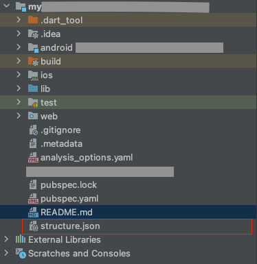

# [convert_structure_to_json](https://pub.dev/packages/convert_structure_to_json)
This package will generate the project structure into a json file.

## 💻 Installing with command line
1. Simply add `dart pub global activate convert_structure_to_json` in the current project terminal.
2. Then run `convert_structure create `. It will generate a json file contain your project structure in json format.
3. That file will be named `structure.json` and locate same level as `lib` folder.
   
